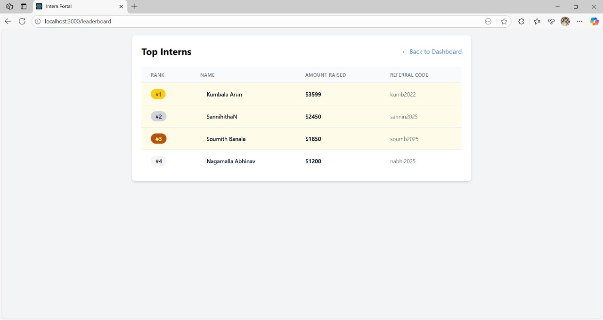
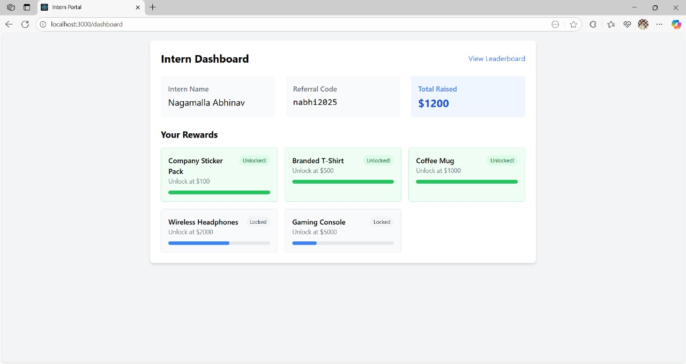
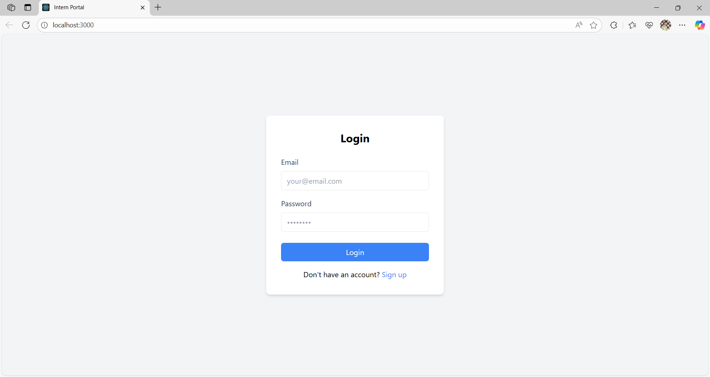
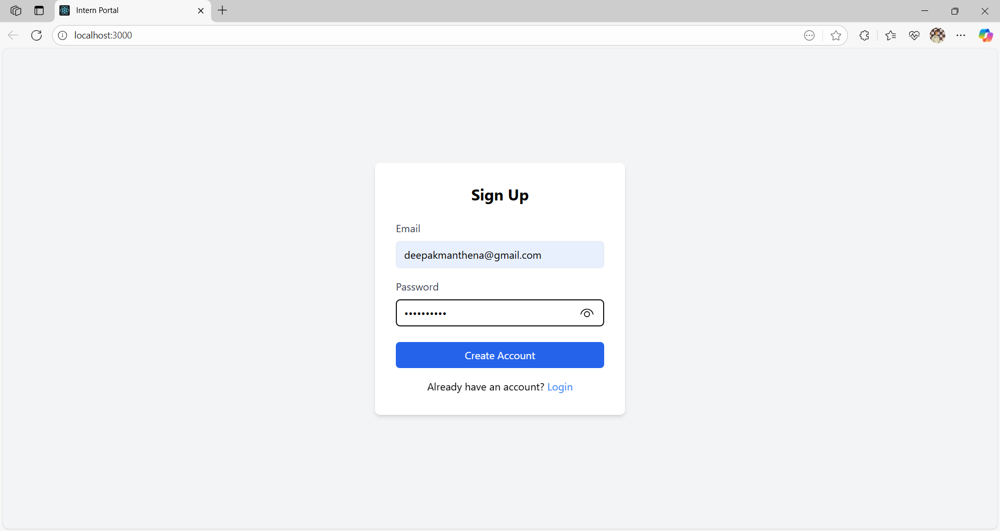

# Intern Portal

This is a web-based **Intern Management Portal** built using the **MERN stack** (MongoDB, Express.js, React, Node.js). It provides features for managing student details, internship records, and reporting.

---

## 🚀 Technologies Used

- **Frontend:**
  - React.js
  - Tailwind CSS (Dark mode enabled by default)
- **Backend:**
  - Node.js
  - Express.js
- **Database:**
  - firebase
- **Others:**
  - React Router
  - REST API Integration
  - ESLint & Prettier for code quality

---

## 📸 Screenshots

> Replace with your actual screenshots inside a `/screenshots` folder.

### Dashboard View

### Rewards

### login

### signup

---

## 🛠️ How to Run the Project

### 📁 1. Project Structure

intern-portal/
├── backend/
├── frontend/
├── screenshots/
└── README.md

---

### ✅ Prerequisites

Make sure you have the following installed:

- [Node.js](https://nodejs.org/)
- [MongoDB](https://www.mongodb.com/)
- npm (comes with Node.js)

---

### 🔧 Step-by-Step Guide

####Setup Backend
cd backend
npm install

###Start the Backend Server
npm start
